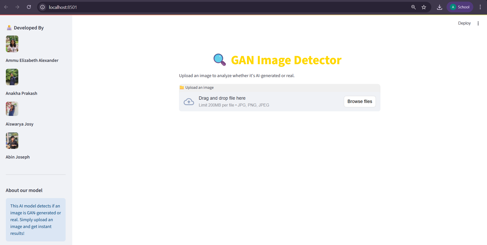
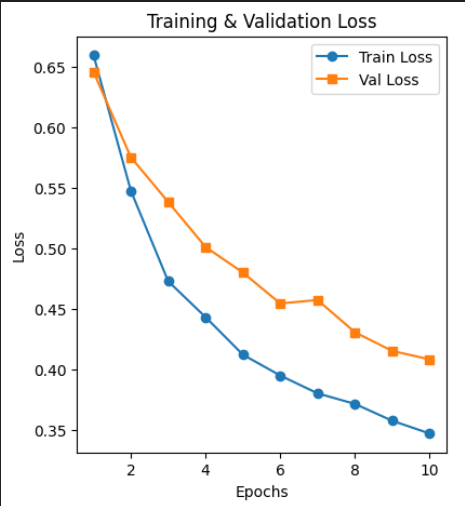
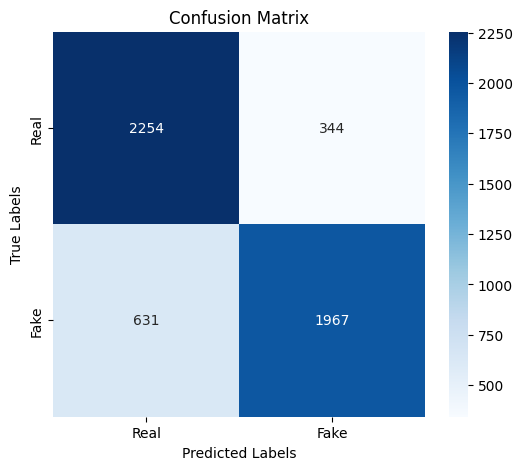
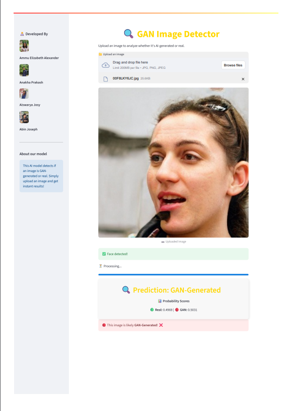

# GAN Image Detector — README

> **Project:** Detection of GAN-Generated Images using MobileNetV3-Large and Streamlit frontend

This README gives step-by-step instructions to set up the environment, prepare data, train the MobileNetV3-Large detector, evaluate results, and run the Streamlit web app for inference.

---

## Overview

A lightweight MobileNetV3-Large based classifier is used to distinguish real images from GAN-generated images. The project includes a training notebook, evaluation utilities, and a Streamlit front-end so users can upload an image and get an authenticity prediction.



---

## Quick links

* `Updated_Training_Notebook_Final.ipynb` — Jupyter Notebook for training and evaluation
* `app.py` — Streamlit frontend
* `models/` — saved model checkpoints
* `data/` — dataset root (structure described below)
* `requirements.txt` — Python dependencies

---

## System / Software requirements

* Python 3.8 – 3.11 recommended
* 8+ GB RAM (more helpful for training)
* GPU recommended (CUDA-compatible) for faster training

---

## Python environment setup (step-by-step)

**Linux / macOS**

```bash
# 1. create and activate venv
python3 -m venv venv
source venv/bin/activate

# 2. upgrade pip and install deps
pip install --upgrade pip
pip install -r requirements.txt
```

**Windows (PowerShell)**

```powershell
python -m venv venv
.\venv\Scripts\Activate.ps1
pip install --upgrade pip
pip install -r requirements.txt
```

**Note on PyTorch:** If you plan to use GPU, visit [https://pytorch.org](https://pytorch.org) to get the exact `pip` or `conda` install command that matches your CUDA version.

---

## `requirements.txt` (example)

```
torch
torchvision
streamlit
numpy
pillow
scikit-learn
matplotlib
pandas
opencv-python
tqdm
```

Add or pin versions as needed (e.g. `torch==2.2.0`), depending on your environment.

---

## Dataset structure

Organize your dataset like this:

```
data/
  train/
    real/
      img1.jpg
      img2.jpg
      ...
    fake/
      fake1.jpg
      fake2.jpg
      ...
  val/
    real/
    fake/
  test/
    real/
    fake/
```

If you have a single image folder with labels in a CSV, adapt the loader or create a small script to split them into class subfolders.

---

## Preprocessing

* Resize images to **128×128** pixels (as used in the project).
* Convert images to PyTorch tensors.
* Normalize using ImageNet mean/std (recommended):

  * mean = `[0.485, 0.456, 0.406]`
  * std  = `[0.229, 0.224, 0.225]`

Example `torchvision.transforms` pipeline:

```python
transforms.Compose([
    transforms.Resize((128,128)),
    transforms.ToTensor(),
    transforms.Normalize(mean=[0.485,0.456,0.406], std=[0.229,0.224,0.225])
])
```

**Optional optimizations**

* Precompute feature maps and save them as `.npy` files to speed up training iterations.
* Use `torch.utils.data.DataLoader` with `num_workers>0` for parallel data loading.

---

## Training (step-by-step)

Open the notebook:

```bash
jupyter notebook Updated_Training_Notebook_Final.ipynb
```

Run the cells in order. The notebook covers:

1. Importing libraries and setting up device (CPU/GPU).
2. Loading the dataset and applying transforms.
3. Defining the MobileNetV3-Large model and replacing the classifier head for binary classification.
4. Training loop with loss calculation, optimizer step, and validation.
5. Saving the best checkpoint in `models/` (e.g., `best_model.pth`).



---

## Evaluation

The notebook includes evaluation cells that compute:

* Accuracy
* Precision, Recall, F1-score
* Confusion matrix

Make sure to point the evaluation cell to your saved checkpoint (e.g., `models/best_model.pth`).



---

## Streamlit frontend (run locally)

**Run the app**

```bash
streamlit run app.py
```

**What `app.py` should implement**

* Simple UI: file uploader, `Predict` button, display image and predicted label with probability.
* Internally: call the same preprocessing as used during training, load the saved model checkpoint, run inference, and show the result.
* Accept common image types: `.jpg`, `.jpeg`, `.png`.

**Example UX flow**

1. Open `http://localhost:8501` in your browser.
2. Upload image.
3. The app preprocesses + runs model.
4. Show result: `Real (0.87)` or `GAN-generated (0.13)` and optionally a bar chart of class probabilities.



---

## Troubleshooting

**Model predicts everything as one class**

* Confirm dataset folder labels and dataset loader mapping (class -> index).
* Try a smaller learning rate.
* Check normalization values.

**GPU not found or CUDA errors**

* Make sure PyTorch build matches your CUDA version.
* If GPU unavailable, run on CPU by setting `device = 'cpu'` in the notebook.

**Slow data loading**

* Increase `num_workers` in DataLoader.
* Use precomputed `.npy` features.
* Ensure images are stored on a fast disk (SSD preferable).

---

## Notes & Improvements

* Extend to video: perform framewise detection + temporal smoothing.
* Multimodal detection: combine multiple cues for manipulated media.
* Adversarial robustness: incorporate adversarial training or anomaly detection.

---

## Contribution & Contact

For questions or collaboration, contact:

* Ammu Elizabeth Alexander — [ammuelizabeth19@gmail.com](mailto:ammuelizabeth19@gmail.com)

---

Thank you — run `streamlit run app.py` to launch the interface.
